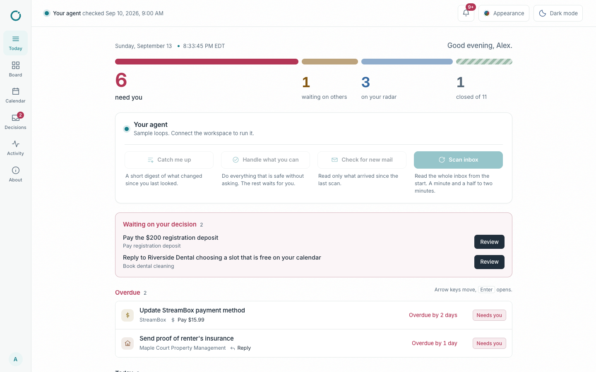
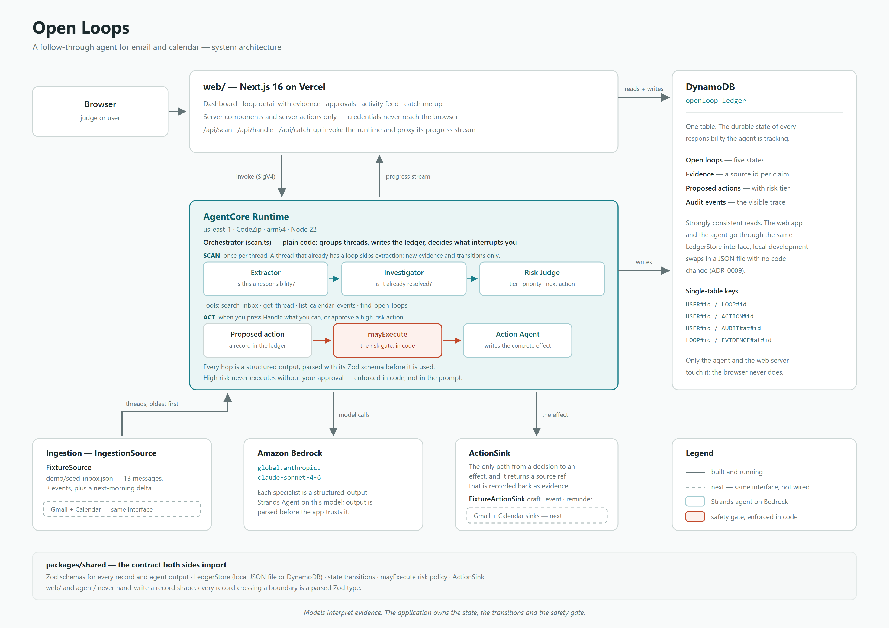

# Open Loops

**Open Loops keeps track of the things you said you would do and never did.** It reads your email and calendar, keeps a persistent, evidence-backed ledger of every unresolved responsibility it finds, quietly handles the low-risk ones, and interrupts you only for the decisions that are genuinely yours.

It is built for people whose obligations arrive as email and quietly expire there — students, above all: a registration deposit due Friday, a proof-of-insurance form nobody chased, a write-up a professor is still waiting on. Inbox assistants summarize what arrived. Open Loops tracks what is still open, and closes it.

Team entry for the AWS **Agents for Humans** hackathon, Everyday Agents track.

| | |
|---|---|
| **Live demo** | _being deployed — see [#19](https://github.com/Omggdavidd/AWS-Hackathon-2026/issues/19); until then, the 60-second local run below needs no AWS account_ |
| **Demo video** | _recorded before submission; link added here_ |
| **Architecture** | [diagram](docs/architecture/openloop-architecture.png) · [system description](docs/architecture.md) |
| **License** | [MIT](LICENSE) |



## What it does

- **Finds the responsibilities, not the emails.** An Extractor decides whether a thread contains something you actually owe someone; a newsletter produces nothing.
- **Checks whether it is already done.** An Investigator searches later mail and calendar entries for a receipt, a reply, a confirmation — so a paid invoice never nags you. This is the behaviour that makes the ledger trustworthy rather than another inbox.
- **Sorts by consequence, not by recency.** A Risk Judge assigns a risk tier, a priority and the next concrete action. A $200 deposit with a Friday deadline outranks a dentist reminder.
- **Shows four states, and says why.** Every loop is *Needs you*, *Waiting*, *Watching* or *Resolved* — plus *Uncertain* when the agent will not guess. Each one links to the exact message or calendar event it was derived from, so any claim can be checked.
- **Handles what it safely can.** *Handle what you can* drafts the replies, creates the calendar events and sets the reminders. Sending mail, paying and anything else high-risk waits for you: that gate is enforced in application code, not in a prompt.
- **Keeps up.** A second scan of the next morning's mail updates existing loops instead of duplicating them, and *Catch me up* tells you what changed since you last looked — state changes and decisions, never "you have 6 new emails".

Built with the **Strands Agents TypeScript SDK** on **Amazon Bedrock** (Claude Sonnet 4.6), deployed to **Amazon Bedrock AgentCore Runtime**, with the ledger in **DynamoDB** and the UI in Next.js 16.

## See it working in 60 seconds

No AWS account, no credentials, no Google connection. Requires [Node 22](.nvmrc) and pnpm 12.

```
git clone https://github.com/Omggdavidd/AWS-Hackathon-2026.git
cd AWS-Hackathon-2026
pnpm install
pnpm --filter @openloop/web dev
```

Open <http://localhost:3000>. The dashboard is already populated from `demo/seed-ledger.json` — the nine loops the agent produces from the seeded inbox of 13 messages and 3 calendar events.

Worth clicking, in order:

1. **A *Needs you* row** — the registration deposit. The loop page says why it exists, what it is waiting on, and what the agent proposes to do.
2. **An evidence line** — every source id links to the original message, so you can check the claim against what the agent actually read.
3. **A *Resolved* loop** — the housing fee. It was created from the request and closed by the "Payment received" reply, which is the resolution detection working.
4. **An action with *Approve* / *Decline*** — a high-risk action the agent prepared but will not execute on its own.

`demo/README.md` lists the expected outcome for every seeded thread, which is also what the tests assert.

If corepack complains about pnpm, install it directly: `npm install -g pnpm@12.3.4`.

## Testing

```
pnpm check      # lint, typecheck, unit tests, and the repository context check
```

This runs with no AWS account: the orchestrator is tested against stubbed specialists, so no test calls a model. Two suites need credentials and are not part of `pnpm check`:

```
OPENLOOP_DYNAMO_TEST_TABLE=openloop-ledger-test pnpm --filter @openloop/ledger-dynamo test
pnpm --filter @openloop/agent scan -- --reset    # the real model over the demo inbox, about 4 minutes
```

## Running the whole system

Only needed to run the agent itself, deploy, or drive the dashboard from DynamoDB. Everything above works without it.

```
aws configure                                        # region us-east-1, output json
pnpm --filter @openloop/ledger-dynamo create-table   # idempotent; creates openloop-ledger
pnpm --filter @openloop/agent deploy-runtime         # deploy to AgentCore Runtime, 1-2 minutes
cp web/.env.example web/.env.local                   # then fill in the table name and runtime ARN
pnpm --filter @openloop/web dev
```

`agentcore status --json`, run from `agent/`, prints the runtime ARN for `web/.env.local`. With both values set, **Scan inbox** runs the real agent over the demo inbox and the dashboard fills in as loops land (about four minutes), **Check for new mail** replays the next morning's batch, **Handle what you can** executes every action the risk gate allows, and **Approve** executes a single high-risk action.

You can also run the agent without the web app:

```
pnpm --filter @openloop/agent scan -- --reset      # first scan
pnpm --filter @openloop/agent scan -- --delta      # the next morning: updates, not duplicates
pnpm --filter @openloop/agent scan -- --handle     # execute everything allowed
pnpm --filter @openloop/agent scan -- --catch-up   # what changed since the last check
```

Never deploy with a bare `agentcore deploy` — see [agent/README.md](agent/README.md) for why.

## How it works

[](docs/architecture/openloop-architecture.png)

The browser talks only to the Next.js server, which invokes the AgentCore Runtime with SigV4. Inside the runtime, an orchestrator written in ordinary code runs three specialist agents per thread and writes the result to DynamoDB; a fourth produces the concrete effect once the `mayExecute` gate allows it. Models interpret evidence — the application owns the state, the transitions and the safety gate.

[docs/architecture.md](docs/architecture.md) describes every component and invariant, and [docs/decisions/](docs/decisions/README.md) records why each choice was made and what was rejected.

## Originality

Newly created during the submission period. No pre-existing code or prior work is incorporated beyond open-source frameworks and libraries (Strands Agents, Next.js, Zod, the AWS SDK) and the scaffolds their own tools generate — `create-next-app` for `web/`, the AgentCore CLI for `agent/agentcore/`. Both are noted where they appear. The seeded demo inbox is fiction: all people, organizations and addresses in `demo/` are invented, and no real personal data is in this repository. Built with AI coding assistants, which the rules permit.

## Working here

| You want to… | Read |
|---|---|
| Know the current phase, what works, what is in flight, what is blocked | [STATUS.md](STATUS.md) |
| Contribute code (branches, commits, PRs, reviews) | [CONTRIBUTING.md](CONTRIBUTING.md) |
| Point an AI coding agent at this repo | [AGENTS.md](AGENTS.md) (Claude Code loads it via [CLAUDE.md](CLAUDE.md)) |
| Understand the system and why it is that way | [docs/architecture.md](docs/architecture.md), [docs/decisions/](docs/decisions/README.md) |
| See how phases work | [docs/process/phases.md](docs/process/phases.md) |
| Plan a multi-PR piece of work | [docs/plans/](docs/plans/README.md) |
| See the hackathon rules and requirements | [docs/hackathon/](docs/hackathon/README.md) |
| Merge something | [docs/process/context-sync.md](docs/process/context-sync.md) |

Every command in this file is listed with its workspace in [AGENTS.md](AGENTS.md) *Commands*. AWS access for teammates: David creates an access key for your `openloop-<login>` IAM user and shares it privately; run `aws configure`. Never paste keys into `.env` files or chat.
