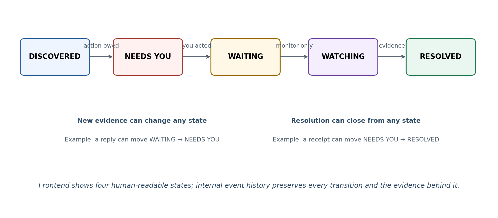
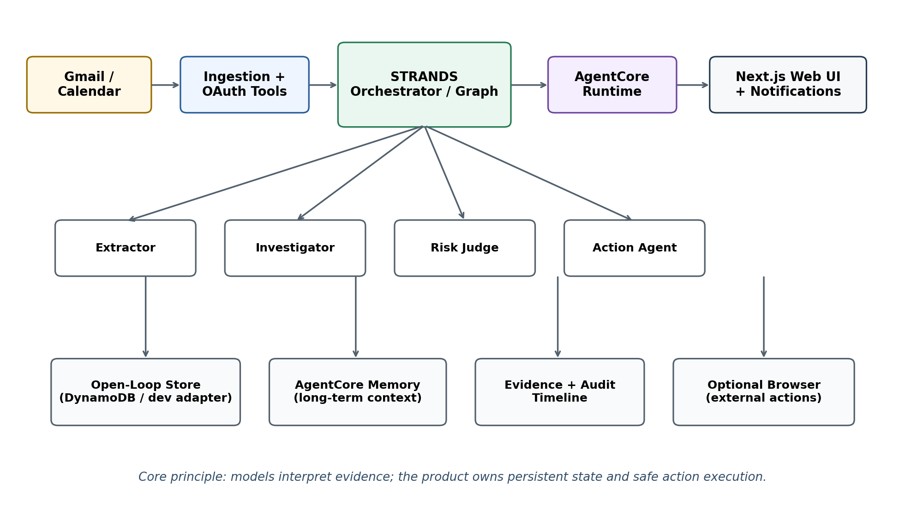

<!-- Canonical hackathon specification. Converted from aws_agents_for_humans_openloop_team_playbook.docx (team playbook dated 2026-09-09) without summarization. Section numbers match the original. When the live Devpost rules differ from anything here, the live rules control. -->

# OPEN LOOPS

AWS Agents for Humans Hackathon
Team Product + Build Playbook

Working concept: a follow-through agent that closes the open loops in your life.

> **The one-line thesis**
> Existing AI helps you read, summarize, search and act on messages. Our agent maintains a persistent, evidence-backed state of what still needs to happen, handles low-risk work automatically, and only interrupts you when a real decision is required.

Prepared for the team · September 9, 2026
Submission deadline: Monday, September 14, 2026 at 8:00 PM EDT (5:00 PM PDT)

## Contents

1. Decision in one page
2. What the hackathon actually wants
3. What an SDK is and what Strands does
4. The product: open loops, not email
5. Why people need this
6. Why this is different from Copilot, Claude and inbox AI
7. Product experience: not chatbot-first
8. Detailed frontend and information design
9. Agent behavior and Strands implementation
10. AWS / AgentCore architecture
11. Data model and state lifecycle
12. Safety, approvals, evidence and trust
13. MVP scope vs stretch scope
14. The five-minute demo story
15. Technical stack and repo structure
16. Execution calendar: Sep 9-14
17. How we score against the judges
18. Hackathon rules and submission checklist
19. Scalability, moat and post-hackathon direction
20. Why the other two ideas become features, not products
21. Official sources and references

## 1. Decision in one page

> **Decision**
> Build Idea #1 as a persistent “Open Loop / Follow-Through Agent.” Use Idea #2 (multi-agent discussion) as the internal Strands architecture. Use Idea #3 (appointments) as one concrete action the agent can take.

The original idea was “AI that reads email, structures unstructured information, ranks what is urgent, and helps reply.” That alone is too close to Copilot, Claude, Shortwave and other inbox AI. The stronger product changes the unit of value from a message to a responsibility: something that entered your life, may span multiple emails and calendar events, and remains active until there is evidence it is finished.

The product should answer, without the user needing to remember the question: “What still needs to happen, what am I waiting on, what is safe, and what has already been handled?”

| Original idea | Final role in the project | Why |
|---|---|---|
| Email deliverables / structured inbox | MAIN PRODUCT: persistent open-loop system | Strongest fit with “background agent”; high impact; clear student demo; becomes broader than email. |
| Multiple AIs work through todo list | INTERNAL ARCHITECTURE | Use specialist agents / a Strands Graph to extract, verify, judge risk and act; makes Strands non-trivial rather than decorative. |
| Year-long appointment manager | ACTION / STRETCH FEATURE | The agent can detect an overdue appointment, find viable times, ask for the one real decision, then book or create the event. |

Recommended track: Everyday Agents

Primary demo audience: students. Product direction after the hackathon: young professionals, founders/freelancers, families and anyone juggling many small responsibilities across channels.

## 2. What the hackathon actually wants

The challenge is not “put AI in an app.” AWS explicitly asks for a new AI agent built with Strands Agents that does real work for real people, handles a repetitive task end-to-end, runs quietly in the background, and surfaces only when a real decision is needed.

> **Design implication**
> A chatbot-only submission is structurally weaker. Our UI should already know what needs attention before the user types anything. Chat exists as a command layer, not as the entire product.

### Tracks

| Track | Official intent | Fit for us |
|---|---|---|
| Everyday Agents | Busywork in daily life: home, money, health, errands, family. Best agents run quietly and ping only for real decisions. | BEST FIT: tuition, forms, replies, appointments, travel, returns, renewals, life admin. |
| Professional Agents | Make professionals/makers/creators/small businesses dramatically better at repetitive, judgment-heavy work. | Possible alternate framing for manager/client follow-through, but narrower than our demo. |
| Good Neighbor Agents | Help groups: neighborhoods, nonprofits, schools, libraries, local organizations. | Not the natural first version unless we pivot to an institution/team shared ledger. |

### Judging model

Stage One is pass/fail for baseline viability and meaningful use of the required SDK. Stage Two uses five equally weighted criteria:

- Technical Implementation — meaningful, skillful, non-trivial Strands use; live demo and/or AgentCore deployment strengthens the score.
- Design — complete, coherent product experience, not just a technical proof of concept.
- Potential Impact — credible, specific problem and audience; demonstrated solution must actually address it.
- Creativity & Originality — creative, non-obvious Strands use and genuine problem understanding.
- Presentation — working end-to-end demo and a clear explanation of problem, audience and why it matters.

## 3. What an SDK is and what Strands does

SDK means Software Development Kit. It is a package of developer building blocks. Instead of hand-writing every part of an agent loop, we use Strands to construct agents, attach models and tools, orchestrate specialists, maintain sessions, and observe behavior.

> **Important distinction**
> Strands is not the AI model. It is the agent framework. The “brain” can be an Amazon Bedrock model, Anthropic, OpenAI, Google, or another supported provider. For this hackathon we should default to Amazon Bedrock so the AWS story is clean.

```
MODEL (e.g., Claude Sonnet on Amazon Bedrock)
        ↓
STRANDS AGENT / GRAPH
        ↓
TOOLS (Gmail, Calendar, database, browser, notifications)
        ↓
PERSISTENT OPEN-LOOP STATE + ACTIONS
```

### Why Strands specifically helps our idea

- Agent creation and tool use: custom tools let the model search Gmail, read a thread, query Calendar, write state, draft a reply, etc.
- Structured output: extraction agents can return typed fields rather than free-form prose.
- Graphs / Swarms / multi-agent patterns: we can split extraction, investigation, risk judgment and action into specialist agents.
- Model-provider flexibility: the architecture is not locked to one LLM.
- Observability hooks: useful for showing judges a real agent pipeline rather than an opaque single prompt.

### Recommended language

Use TypeScript. Strands has a TypeScript SDK, AgentCore has a TypeScript CLI flow, and we can keep the frontend, schemas, agent code and shared types in one language. Current Strands TypeScript quickstart requires Node.js 22+ and installs with:

```
npm install @strands-agents/sdk
```

AgentCore can scaffold a TypeScript Strands agent with its CLI, test it locally, then deploy it to AgentCore Runtime. This is the fastest path to “we used the required SDK meaningfully and deployed on AWS.”

## 4. The product: open loops, not email

An inbox stores messages chronologically. A human life is not chronological; it is a set of incomplete, waiting, upcoming and resolved responsibilities. The core product is a persistent ledger/graph of those “open loops.”

### Example: tuition

```
EMAIL (Aug 14)
“Your $200 registration deposit must be received by Sep 15.”
        ↓
OPEN LOOP
Title: Pay registration deposit
Amount: $200
Due: Sep 15
Consequence: registration may be affected
Status: NEEDS_YOU
Evidence: original university email
Resolution evidence: none found
```

Marking the email read or archiving it does not close the loop. The responsibility remains active until the system finds credible evidence it is complete or the user explicitly resolves/dismisses it.

### Resolution detection is the killer behavior

```
Aug 14: “Pay $200 before Sep 15.”     → open loop created
Sep 10: “Payment received. Thank you.”   → evidence linked
System: NEEDS_YOU → RESOLVED ✅
```

The same pattern works for a submitted form, approved document, refund confirmation, meeting acceptance, shipped return, manager approval, or any other later evidence that closes an earlier loop.

### Consequence-aware priority

Traditional task managers often ask “what priority is this?” We should infer “what happens if this is ignored?” That makes ranking more useful and demonstrable.

| Open loop | Deadline | Likely consequence | Priority |
|---|---|---|---|
| Netflix payment | Tomorrow | Streaming pauses | Low |
| Tuition deposit | 4 days | Registration could be affected | Critical |
| Reply to manager | No explicit date | Work blocked / trust affected | High |
| Amazon return | 9 days | $84 refund lost | Medium |

## 5. Why people need this

The product is useful when the user has many contexts and small commitments. The problem is not simply “too many emails.” It is that the person is currently acting as the database that remembers what each message means, whether it is still open, who owes the next action, whether the deadline changed, and whether it was ever completed.

### Student case

- Tuition / registration deposits and financial deadlines
- Professor or TA requests, assignments, forms and course administration
- Club meetings, event confirmations and leadership follow-ups
- Co-op / job applications, advisor forms, onboarding tasks and manager emails
- Housing: landlord requests, insurance, lease documents, maintenance access
- Travel: flight changes, check-in, visas/passports and booking changes
- Appointments and recurring personal maintenance
- Returns, subscriptions, bills and other small life-admin deadlines

### Beyond students

| Audience | Typical open loops |
|---|---|
| Employee | Manager requests, mandatory training, expense reports, HR enrollment, security tasks, customer follow-ups, approvals. |
| Founder / freelancer | Client revision → waiting on client → approval → invoice → waiting on payment → resolved. One responsibility can span many messages over weeks. |
| Regular adult life | Insurance, lease renewal, passport expiry, car service, returns, bills, appointments, warranties, government forms, subscriptions. |
| Families | School forms, activities, appointments, renewals, household logistics and “who is waiting on whom?” |

> **Who does not need it?**
> Someone with very few meaningful messages and little life-admin probably does not. The wedge is people with multiple contexts whose small open loops accumulate faster than they can reliably remember.

## 6. Why this is different from Copilot, Claude and inbox AI

We must be precise here. Copilot and Claude are powerful competitors. If our product is “AI scans email, summarizes what is important, drafts replies and makes reminders,” they already cover much of it. The differentiation is not a better language model; it is a different product object and lifecycle.

### Microsoft Copilot / Outlook

Current Outlook Prioritize reviews new incoming messages and labels them high/normal/low, provides a brief summary and explains why a message may be important. Microsoft also states that Prioritize does not go back and prioritize older existing messages after activation. This is message-level prioritization, not a persistent lifecycle for a responsibility that may remain active for months.

### Claude / Cowork

Claude can search and read Gmail, draft/send/reply/forward, manage Google Calendar, track unanswered emails, and run recurring Cowork tasks in the cloud. That makes Claude the strongest “couldn’t I just ask Claude?” competitor. We should not pretend otherwise.

> **Our boundary**
> Claude/Copilot are general workers over messages and tools. Our product is a purpose-built system of record for unresolved responsibilities: explicit persistent states, source evidence, deadline/consequence, “waiting on,” automated resolution detection, safe escalation, and an interface built around follow-through rather than conversations.

| Dimension | Copilot / Claude style | Our product |
|---|---|---|
| Primary object | Email, conversation, task/session | Open loop / responsibility |
| User trigger | Prompt, inbox view, scheduled task | New evidence changes state; background processing |
| Old message | Searchable context | Can still represent an active responsibility |
| Persistence | General product/session memory | Explicit typed state with lifecycle + audit trail |
| Completion | Can infer when asked | Expected system behavior: detect evidence and close/update state |
| Waiting on others | Can reason about it | First-class status with follow-up policy |
| Consequence | Can infer | Stored + used for ranking/escalation |
| Interface | Inbox/chat/task-centric | Needs You / Waiting / Watching / Resolved |
| Trust | General citations/approvals | Per-loop evidence, confidence, status history, action audit |

### Shortwave and other inbox AI

Shortwave can analyze threads, identify action items, extract dates, turn email into todos, and create Calendar events. That reinforces the same rule: “extract action items from email” is not enough. The differentiator must be persistent closed-loop tracking across time, evidence, status transitions and autonomous follow-through.

### Competitive truth

Any major AI platform could eventually copy this workflow. The near-term wedge is an opinionated product and state model they do not currently surface as the core experience. Do not pitch “our AI is smarter.” Pitch “our product continuously owns the lifecycle of what still needs to happen.”

## 7. Product experience: not chatbot-first

The home screen must be useful without typing. A blank “How can I help?” screen is the wrong UX because the user has to remember what they forgot. The agent should already have processed the user’s connected sources and surface only current state.

> **Product test**
> If the user can open the app, type nothing, and instantly understand what needs attention, what is waiting, what is safe, and what changed, we are building the right thing.

### Four primary human-readable states

| State | Meaning | Typical actions |
|---|---|---|
| NEEDS YOU | The next move belongs to the user. | Pay, reply, submit, sign, choose, review, confirm. |
| WAITING | The user acted; someone/something else owes the next move. | Wait, follow up after policy threshold, monitor reply/refund/approval. |
| WATCHING | Nothing needs action now; the agent is monitoring for change. | Flight, application, package, renewal, upcoming date. |
| RESOLVED | The responsibility is closed, manually or by evidence. | Audit/history only unless reopened by new evidence. |



## 8. Detailed frontend and information design

### A. Home dashboard

```
Good evening, David                              Ask Agent ⌘K

3 things need you. 2 are waiting on others. Nothing critical changed today.

NEEDS YOU
🔴 Registration deposit        Due in 3 days
    $200 · University · No confirmation found
    [Resolve] [Show evidence]

🟠 Property manager            Due tomorrow
    Proof-of-insurance reply draft is ready
    [Review reply]

WAITING
🟡 Issue #1 review             Waiting 3 days
    Sent to Bill. No response yet.
    Follow-up suggested tomorrow.

WATCHING
Flight: Toronto -> London     Oct 17
   No action required. Watching itinerary changes.
```

This dashboard is the product. Chat is available, but it is secondary.

### B. Individual open-loop detail

- Title, amount/date/category and current state
- Why this exists: originating source(s)
- What the agent found / did not find
- Confidence that it is still unresolved
- Consequence if ignored
- Suggested next action
- Evidence list with links back to sources
- Timeline of state changes
- Action buttons: I already did this / Handle it / Remind / Ignore / Show source

```
Registration Deposit                         🔴 Needs You
$200 · Due Sep 12

WHY THIS EXISTS
Aug 14 · University email — payment required

WHAT I FOUND
✓ Payment request found
✓ Deadline identified
✕ No receipt found after Aug 14
✕ No confirmation email found

Confidence: 86% this is still outstanding
Consequence: registration may be affected

[I already did this] [Take me to payment] [Remind tomorrow]
```

### C. Timeline / evidence history

```
Sep 2   Property manager requested proof of insurance.
Sep 3   You sent the document.
Sep 3   NEEDS YOU → WAITING.
Sep 7   No response after 4 days.
Sep 9   Agent recommends a follow-up.
```

### D. “Catch me up”

A single action summarizes meaningful state changes since the last check: approvals received, deadlines approaching, waiting items, changed itineraries, and “nothing else needs you.” This is superior to “summarize my emails” because it is state-change oriented.

### E. “Handle what you can”

```
I can handle 4 of your 7 open items:
✓ Add club meeting to Calendar
✓ Prepare property-manager reply
✓ Follow up on Issue #1
✓ Close resolved university thread

I need you for:
→ $200 tuition payment
→ Choose appointment time
→ Approve manager email
```

### F. Agent activity feed

A quiet audit feed shows what happened in the background: “closed Amazon return after refund confirmation,” “moved Issue #1 to Waiting,” “updated flight departure,” etc. This builds trust and demonstrates background agency to judges.

### G. Chat / command bar

Chat is an optional command layer. Useful prompts: “What is the most important thing I have not done?”, “Why do you think tuition is unpaid?”, “Handle everything safe today,” “Reply to everyone I am holding up,” “Anything from school I forgot?”, “What am I waiting on?”

### H. Notifications

Never notify “you have 6 emails.” Notify state changes and decisions: “One thing needs you,” “Bill approved Issue #1 — marked resolved,” “Your flight changed by 45 minutes and does not conflict with anything, so no action is needed.” The ideal agent sometimes decides not to notify at all.

### Visual direction

- Clean, calm, high-trust interface. Think Linear / Things / Apple Wallet more than ChatGPT or Slack.
- Use generous white space, compact cards, strong typography, status chips and subtle urgency—not a noisy “AI dashboard.”
- Desktop: sidebar + open-loop list + detail panel. Mobile: stacked cards + bottom state tabs + Ask Agent button.
- Do not expose raw chain-of-thought. Show evidence, source links, concise “why,” confidence and action history instead.

## 9. Agent behavior and Strands implementation

The technical implementation must make Strands central. The cleanest pattern is a Strands Graph (or orchestrator with specialist agents as tools) where each agent has a narrow role and structured output. This is better than “three AIs debate” with no purpose.

### Recommended specialist roles

| Agent | Responsibility | Output |
|---|---|---|
| Extractor / Scout | Read candidate message/event and determine whether it creates/updates a real open loop. | Typed candidate: action, deadline, requester, amount, source, confidence. |
| Investigator / Verifier | Search subsequent and related sources for evidence of completion, change, duplication, or contradiction. | Evidence bundle + proposed state. |
| Risk Judge | Assess consequence, urgency, uncertainty and whether action requires approval. | Risk tier, priority, recommended next action. |
| Action Agent | Execute approved/low-risk work through tools. | Action result + evidence + audit entry. |
| Orchestrator | Routes the loop, writes durable state, decides whether a human interruption is justified. | Final state transition and user-facing event. |

### Graph behavior

```
NEW EMAIL / EVENT
      ↓
EXTRACTOR — does this create or modify a responsibility?
      ↓ yes
INVESTIGATOR — search related history for resolution / update evidence
      ↓
RISK JUDGE — how urgent / consequential / uncertain is this?
      ↓
ORCHESTRATOR — write/update the open loop
      ↓
ACTION AGENT — execute only if safe / approved
      ↓
STATE CHANGE + AUDIT + (optional) NOTIFICATION
```

### Custom tools to implement

- search_gmail(query, after/before, sender, thread context)
- get_gmail_thread(thread_id)
- draft_email(to, subject, body)
- send_email(draft_id) — approval-gated
- list_calendar_events(range)
- create_calendar_event(payload) — low/medium-risk policy
- upsert_open_loop(payload)
- find_open_loops(filters)
- append_evidence(loop_id, source)
- transition_loop(loop_id, new_state, reason)
- propose_action(loop_id, type, payload, risk_tier)
- execute_approved_action(action_id)
- optional later: browser_find_times / browser_fill_form through AgentCore Browser

### Structured output

Do not parse loose prose. Define Zod schemas for candidate extraction, evidence decisions, risk judgments and actions. The model may reason, but the application receives typed data it can validate before writing to state or performing a tool call.

### What we should NOT do

- One giant prompt that reads the entire inbox every time.
- A single agent with every permission and no risk boundary.
- “AI debate” as a gimmick rather than role separation.
- Store only summaries; lose source IDs/evidence and make the system unauditable.
- Expose private chain-of-thought. Evidence + concise rationale is sufficient and safer.

## 10. AWS / AgentCore architecture



### What AgentCore adds

- Runtime: a purpose-built serverless environment for hosting agents, with session isolation and long-running support.
- Memory: short- and long-term memory; useful for stable user preferences/context, but our open-loop ledger should remain explicit application state.
- Identity: agent-oriented credential and OAuth management for accessing AWS or third-party services safely.
- Gateway: expose APIs/Lambda/MCP tools through one governed tool entry point; useful if time permits.
- Browser: isolated browser sessions for form filling, booking and websites without APIs; strong stretch feature for appointments.
- Observability: CloudWatch logs/traces/metrics for runtime, memory, tools and identity. Great material for the technical demo.

> **Recommended hackathon architecture**
> Use AgentCore Runtime for the Strands agent. Use a simple explicit open-loop store (DynamoDB in AWS; a local adapter for demo/testing). Add AgentCore Memory for durable user context if time permits. Browser/Gateway are stretch, not day-one blockers.

### AWS account / credits

The rules require an AWS account and Strands. Registered entrants may request $50 in AWS promotional credits while supplies last. The current rules say the request form deadline is September 11 at 12:00 PM Pacific (3:00 PM Eastern), credits expire October 31, and entrants are responsible for charges beyond the credit.

## 11. Data model and state lifecycle

### OpenLoop

```
OpenLoop {
  id, userId, title, category,
  status: NEEDS_YOU | WAITING | WATCHING | RESOLVED | UNCERTAIN,
  requestedBy, owner, actionType,
  dueAt, amount, consequence, riskLevel, confidence,
  nextAction, waitingOn,
  sourceRefs[], evidence[],
  createdAt, updatedAt, resolvedAt?
}
```

### Evidence

```
Evidence {
  id, loopId, sourceType, sourceId, threadId?,
  observedAt, excerptOrSummary,
  supports: OPEN | RESOLVED | UPDATED | CONTRADICTS,
  confidence
}
```

### ProposedAction

```
ProposedAction {
  id, loopId, type, riskTier,
  requiresApproval, payload,
  status: PROPOSED | APPROVED | EXECUTED | FAILED | CANCELLED,
  createdAt, executedAt?, resultEvidence?
}
```

### Why explicit application state matters

The state must not exist only in model memory. A real product needs deterministic records the UI can query, test and audit. The model interprets evidence; the application owns the ledger.

### Ingestion strategy

On first connection, backfill a bounded historical window (for demo: 3-6 months). After onboarding, process only deltas: new messages/events and related threads. This avoids repeatedly passing an entire inbox to an LLM and makes the architecture scalable and cheaper.

## 12. Safety, approvals, evidence and trust

High-consequence actions must not be executed simply because an LLM inferred intent. The product should have explicit permission tiers.

| Risk tier | Examples | Default behavior |
|---|---|---|
| Low | Classify, add watch state, create reminder, archive already-resolved thread, update local state. | May execute automatically; always audit. |
| Medium | Draft email, create tentative calendar event, prepare form, suggest appointment slots. | Can prepare automatically; execution policy may require approval. |
| High | Send sensitive email, submit application, book paid service, make/cancel payment, sign/accept terms. | Explicit user approval required before execution. |

### Evidence-backed claims

Do not say “you have not paid tuition” as a fact unless there is reliable evidence. Say “probably unresolved” and show why: payment request found, deadline found, searched subsequent messages, no receipt/confirmation found. Include confidence and allow “I already did this.”

### Trust rules for the MVP

- Every loop keeps source IDs and links to original evidence.
- Every state change gets a timestamped reason.
- Every action is logged; destructive or consequential actions require approval.
- Use least-privilege OAuth scopes.
- Avoid storing full email bodies if IDs + minimal excerpts/structured facts are enough.
- Keep demo data seeded/synthetic unless every team member is comfortable with personal inbox data appearing on screen.

## 13. MVP scope vs stretch scope

### Must ship

- Public GitHub repo with MIT license and strong README
- Working Strands agent (TypeScript) using a non-trivial graph / specialist flow
- AgentCore Runtime deployment
- Gmail ingestion OR a robust seeded Gmail-like demo mode; ideally both
- Persistent open-loop records with Needs You / Waiting / Watching / Resolved
- Evidence-backed extraction and resolution detection
- Dashboard + detail view + timeline
- At least one safe action: draft an email OR create a calendar event
- Approval flow for high-risk action
- Catch Me Up summary
- Architecture diagram and observability screenshot/trace
- Polished 5-minute demo video

### Stretch only after must-ship works

- Live Google Calendar action
- Appointment discovery/booking
- AgentCore Browser automation
- AgentCore Gateway
- Push/email notifications
- Multiple connected channels (Slack, SMS, school portals)
- Sophisticated semantic memory/personalization
- Full multi-tenant auth/billing/production hardening

> **Scope rule**
> A flawless five-minute story with five loops is worth more than thirty half-working features. Optimize for a judge understanding the product in 20 seconds and seeing real end-to-end agency in under 3 minutes.

## 14. The five-minute demo story

Use a realistic seeded student inbox so every branch is deterministic and safe to record. The best moment is the system finding something the student genuinely “forgot,” then proving why it matters.

### Seeded scenario

- University deposit request from weeks ago — still unresolved and now due soon.
- Later receipt for a different university payment — auto-resolved to prove resolution detection.
- Property manager asks for insurance — draft reply ready.
- Manager/professor thread — user replied, so state is Waiting; follow-up threshold is near.
- Club meeting moved — Calendar/watch state updates; no urgent interruption.
- Flight itinerary — Watching; if changed but conflict-free, agent records change without demanding action.
- Optional dentist reminder — “due for next visit”; propose available time rather than making the user start from zero.

### Suggested video sequence

| Time | Scene | What judge learns |
|---|---|---|
| 0:00-0:30 | Problem: “Your inbox stores messages. Your life is open loops.” Show messy inbox. | Immediate problem clarity. |
| 0:30-1:10 | Connect/scan demo data. “13 things worth checking” emerges. | Proactive, not chat-first. |
| 1:10-2:00 | Open tuition card; show old source, deadline, missing confirmation, confidence and consequence. | Historical persistence + evidence. |
| 2:00-2:45 | Show a later receipt closing another loop automatically. | Closed-loop reasoning, not todo extraction. |
| 2:45-3:30 | “Handle what you can”: create Calendar event / draft reply; high-risk item waits for approval. | Real agent actions + safety. |
| 3:30-4:10 | Show Waiting/Watching transitions and recent activity. | Background autonomy + product design. |
| 4:10-4:40 | Show Strands Graph + AgentCore Runtime/observability architecture. | Technical implementation credibility. |
| 4:40-5:00 | Who it is for, expansion beyond students, why it matters, closing line. | Impact + presentation. |

> **Closing line**
> Inbox AI organizes messages. Open Loops manages responsibilities.

## 15. Technical stack and repo structure

### Recommended stack

| Layer | Choice | Reason |
|---|---|---|
| Language | TypeScript | One language across Next.js, shared schemas and Strands; AgentCore has a TypeScript flow. |
| Frontend | Next.js + React + Tailwind | Fast polished dashboard; easy live deploy. |
| Agent framework | @strands-agents/sdk | Required SDK; supports tools, structured output, Graphs/Swarms. |
| Model | Amazon Bedrock (default Strands model or explicitly configured supported Claude/Nova) | Clean AWS implementation; provider can be swapped later. |
| Agent hosting | Amazon Bedrock AgentCore Runtime | Explicitly strengthens Technical Implementation score. |
| Persistence | DynamoDB adapter + local/dev adapter | Durable state; local fallback keeps demo moving if AWS config blocks. |
| Integrations | Google Gmail API + Calendar API | Directly demonstrates student use case. |
| Validation | Zod | Typed tool inputs and structured model outputs. |
| Observability | AgentCore / CloudWatch + app audit log | Debugging + judge proof. |
| Frontend hosting | Fastest reliable option (Vercel or AWS hosting) | Do not spend a day on hosting unless it improves the demo. |

### Repo structure

```
openloop-agent/
├── README.md
├── LICENSE                         # MIT
├── AGENTS.md                       # project instructions / architecture
├── .env.example
├── docs/
│   ├── architecture.md
│   ├── architecture.png
│   ├── demo-script.md
│   └── submission-checklist.md
├── web/                             # Next.js product UI
│   ├── app/
│   ├── components/
│   └── lib/
├── app/OpenLoopAgent/               # AgentCore-generated Strands TS agent
│   ├── main.ts
│   ├── agents/
│   │   ├── extractor.ts
│   │   ├── investigator.ts
│   │   ├── risk-judge.ts
│   │   └── action-agent.ts
│   ├── tools/
│   │   ├── gmail.ts
│   │   ├── calendar.ts
│   │   ├── open-loops.ts
│   │   └── actions.ts
│   ├── schemas/
│   └── services/
├── packages/shared/                 # shared Zod schemas/types
├── demo/
│   ├── seed-emails.json
│   └── seed-open-loops.json
└── agentcore/                       # AgentCore CLI config
```

### AgentCore bootstrap commands

```
npm install -g @aws/agentcore
agentcore create --project-name OpenLoop --no-agent
cd OpenLoop
agentcore add agent --name OpenLoopAgent --type create --build CodeZip --language TypeScript --framework Strands --model-provider Bedrock --memory none
agentcore dev
# once working locally:
agentcore deploy
agentcore status
agentcore invoke --runtime OpenLoopAgent "Run a catch-up over the demo inbox"
```

The exact CLI output/paths should be allowed to follow the installed current AgentCore version; do not fight the generator. Keep the repo coherent and document any deviations in README.

## 16. Execution calendar: Sep 9-14

Current working window: Wednesday night, September 9 through Monday, September 14. Build backwards from a submission that must be completely uploaded before 8:00 PM Eastern on September 14.

### Tonight — Wed Sep 9

- Lock product thesis, name/codename and Everyday Agents track. Do not reopen ideation after this.
- Make sure every team member is registered on Devpost and one person is the submission representative.
- Request AWS credits now; official request deadline is Sep 11 at noon PT / 3 PM ET, while supplies last.
- Give Claude the build prompt. Claude must create/initialize the repo, add MIT license, README skeleton, AgentCore project and Next.js shell.
- Get a “hello world” Strands agent running locally before sleeping.
- Create deterministic seed data for 5-7 demo open loops.

### Thu Sep 10 — core state + UI

- Implement OpenLoop/Evidence/Action schemas and persistence adapter.
- Build Extractor with structured output.
- Seed ingestion path + first historical scan.
- Build Dashboard, state tabs and detail panel.
- Make one loop appear from seed data end-to-end.
- Start README continuously; do not leave docs to Monday.

### Fri Sep 11 — investigation + AWS

- Implement Investigator / resolution detection across related later messages.
- Implement Risk Judge and state transition rules.
- Wire Gmail API if credentials are ready; keep demo seed mode as fallback.
- Deploy Strands service to AgentCore Runtime; confirm status/invoke and capture logs.
- Add AgentCore Memory only if Runtime is stable.
- Deadline: AWS credit request by 12 PM PT / 3 PM ET.

### Sat Sep 12 — actions + safety

- Implement Action Agent with at least one real action (email draft or Calendar event).
- Add approval gate and ProposedAction state.
- Build “Catch me up,” “Handle what you can,” and activity feed.
- Finish evidence links, confidence and timeline UI.
- Test failure paths: duplicate email, already-resolved loop, ambiguous deadline, unsafe action.

### Sun Sep 13 — polish + submission assets

- Freeze feature scope by midday. Only fix bugs and presentation after that.
- Polish mobile/desktop layout and first-use scan animation.
- Finalize architecture diagram and README setup instructions.
- Deploy live frontend and verify public testing instructions.
- Write Devpost description and five-minute video script.
- Publish at least one builder.aws post for bonus points if time permits; use “Agents for Humans” in the title.
- Record a rehearsal and time it. Cut anything that does not improve a judging criterion.

### Mon Sep 14 — submission day

- Morning: full clean-machine install/test from README; fix only blockers.
- Verify public repo, license visibility, no leaked credentials/secrets, architecture diagram, screenshots and demo data.
- Record final video early; upload it as public on YouTube or Vimeo, per the rules; verify visibility before submitting.
- Complete Devpost form, AWS Builder ID and testing instructions.
- Submit by 7:00 PM ET internal deadline to keep a one-hour buffer before the official 8:00 PM ET cutoff.
- After submission, do not rely on being able to change anything; official rules say substantive changes are not allowed once the submission period ends.

### Suggested team split

| Owner | Primary focus | Daily integration requirement |
|---|---|---|
| Person A — Agent/AWS | Strands Graph, tools, AgentCore Runtime, observability | Must expose stable typed interfaces to frontend by end of each day. |
| Person B — Frontend/Product | Dashboard, detail/evidence, activity, approvals, demo polish | Uses seed adapter first; never blocked on Gmail/AWS. |
| Person C — Integrations/Data | Gmail/Calendar OAuth, storage adapter, seed fixtures, testing | Keeps deterministic demo path working even if OAuth is flaky. |
| Everyone | README, test cases, pitch, demo rehearsal | 15-minute merge/demo sync at least twice daily. |

## 17. How we score against the judges

| Criterion | What we should deliberately show |
|---|---|
| Technical Implementation | Strands Graph with specialist agents; typed tools; actual state transitions; AgentCore Runtime; observability; real action execution; not one prompt wrapper. |
| Design | Dashboard-first experience, four states, evidence detail, quiet notifications, activity audit, polished onboarding; works without chat. |
| Potential Impact | Start with students and concrete tuition/housing/work/club examples; explain broader follow-through burden for professionals/families. |
| Creativity & Originality | Shift from “important email” to “persistent open loop”; historical responsibilities stay alive; resolution detection; waiting-on state; consequence-aware ranking. |
| Presentation | One deterministic narrative: messy inbox → old forgotten obligation → evidence → auto-resolution → safe agent action → approval → architecture. |

### Judging traps to avoid

- Spending the demo talking about LLMs instead of the human problem.
- Showing only screenshots / mockups; the rules require working functionality consistent with the video.
- A beautiful UI with Strands hidden behind one trivial call.
- An impressive agent with no coherent product surface.
- Making claims about “autonomy” while every step needs a prompt.
- Risky automatic actions with no approval model.

## 18. Hackathon rules and submission checklist

### Key dates

| Item | Date / time |
|---|---|
| Submission period | Aug 10, 2026 9:00 AM PT → Sep 14, 2026 5:00 PM PT (8:00 PM ET) |
| AWS $50 credit request | By Sep 11, 2026 12:00 PM PT (3:00 PM ET), while supplies last |
| Judging | Sep 15 9:00 AM PT → Oct 8 5:00 PM PT |
| Winners announced | On or around Oct 14, 2026 2:00 PM PT |

### Eligibility / project rules

- Entrants can be eligible individuals, teams or organizations; individuals must be at least the age of majority where they reside.
- Teams are allowed; FAQ states there is no team-size limit. A team must appoint an authorized representative for submission/prize administration.
- Geographic exclusions apply. The official rules list excluded countries/territories and specifically exclude residents of Quebec; each team member should verify eligibility.
- An AWS account is required and the project must install/use Strands Agents.
- Project must be newly created during the Aug 10-Sep 14 submission period. Standard frameworks, libraries, starter templates and AI coding assistants are permitted; disclose other pre-existing code/work incorporated.
- Third-party APIs/SDK/data must be used with proper authorization/licensing.
- Project must actually run on its intended platform and behave as depicted/described.
- Multiple submissions are allowed only if they are unique and substantially different.
- Submission must be original work and respect IP/privacy rights.

### Required submission assets

- ☐ Text description explaining features/functionality
- ☐ PUBLIC GitHub/GitLab/Bitbucket repository
- ☐ All source code, assets and setup instructions needed to run
- ☐ MIT or Apache open-source license file, visible/detectable on repo page
- ☐ README
- ☐ Architecture diagram
- ☐ Demo video, maximum 5 minutes
- ☐ Video demonstrates the working project
- ☐ Pitch covers: problem, who it is for, why it matters
- ☐ Video hosted publicly on YouTube or Vimeo
- ☐ AWS Builder ID
- ☐ Testing access/instructions; if private site, provide credentials; project must remain available free for judging through judging period

### Optional scoring boosters

- Live demo link — explicitly helps Technical Implementation score.
- AgentCore deployment — explicitly strengthens Technical Implementation.
- builder.aws post(s) about the build + AWS implementation. Rules say qualifying posts can add up to 0.6 bonus points in Stage Two (0.2 each, max 0.6). The rules page was updated Aug 12 to remove the #AgentsforHumans hashtag requirement; use “Agents for Humans” in the title.

### Prizes

| Prize | Amount / item |
|---|---|
| Grand Prize | $10,000 + AWS social feature + AWS expert session/roundtable |
| Everyday Gold | $5,000 + AWS social feature |
| Everyday Silver | $3,000 + AWS social feature |
| Everyday Bronze | $2,000 + AWS social feature |
| Professional Gold / Silver / Bronze | $5,000 / $3,000 / $2,000 |
| Good Neighbor Gold / Silver / Bronze | $5,000 / $3,000 / $2,000 |

A project can win one prize. Prize/tax/verification details are governed by the official rules; use the official page for any legal eligibility question.

## 19. Scalability, moat and post-hackathon direction

### Technical scalability

- Backfill once, then process only new/changed sources.
- Store structured state rather than repeatedly reasoning over full inbox history.
- Use source IDs to fetch full content only when needed.
- Classify cheaply first; spend stronger-model reasoning on ambiguous/high-risk candidates.
- Partition state per user and enforce least-privilege connectors.
- Event-driven ingestion later (webhooks / push notifications) instead of constant broad rescans.

### Product moat

The defensible asset is not a proprietary model. It is the state graph, the UX and the accumulated structured understanding of follow-through: what types of responsibilities exist, how evidence closes them, which actions are safe, who is waiting on whom, and how to rank consequence.

```
Gmail ─┐
Calendar ├─→ OPEN LOOP GRAPH ─→ decisions / actions / evidence / state
Slack ───┤
Docs ────┤
Portals ─┘
```

Email is the first sensor, not the product boundary. Long term, the open-loop graph can ingest Calendar, Slack, SMS, documents, school portals, bank notifications, travel systems and other sources.

### Possible product language

- “Your inbox knows what you were asked to do. We keep it alive until it is done.”
- “We build an agent that closes the open loops in your life.”
- “The agent remembers so you do not have to.”
- “Inbox AI organizes messages. We manage responsibilities.”

## 20. Why the other two ideas become features, not products

### Idea #2 — autonomous todo / multiple AI discussion

As a standalone product it competes with general autonomous work platforms. The sharper use is inside our agent: specialist agents disagree/verify before escalating, and the user is only asked when uncertainty or risk is real. That turns “AI discussion” from a gimmick into a reliability architecture.

### Idea #3 — appointments

The insight is strong: the hardest part is often initiating and arranging the appointment, not attending it. But “AI books appointments” is already crowded and cross-site booking is technically risky under a five-day deadline. Use it as a compelling action path: detect the maintenance need, look at calendar availability, find options, ask one decision, then book/create the event. AgentCore Browser becomes a natural stretch implementation where APIs do not exist.

### Final product combination

```
IDEA #1 = WHAT the product owns
Persistent open loops / follow-through

IDEA #2 = HOW the agent reasons
Specialist Strands agents / Graph / verification

IDEA #3 = ONE THING the agent can do
Initiate and arrange appointments when a loop calls for it
```

## 21. Official sources and references

These are the sources the team should treat as authoritative for implementation and submission. Product competitor pages are included only to ground differentiation; capabilities can change quickly.

[Agents for Humans — Official Rules](https://agentsforhumans.devpost.com/rules)

[Agents for Humans — Dates](https://agentsforhumans.devpost.com/details/dates)

[Agents for Humans — FAQ](https://agentsforhumans.devpost.com/details/faqs)

[Strands Agents — Get Started](https://strandsagents.com/docs/user-guide/quickstart/overview/)

[Strands Agents — TypeScript Quickstart](https://strandsagents.com/docs/user-guide/quickstart/typescript/)

[Strands Agents — Graph multi-agent pattern](https://strandsagents.com/docs/user-guide/concepts/multi-agent/graph/)

[Strands Agents — Tools](https://strandsagents.com/docs/user-guide/concepts/tools/)

[Amazon Bedrock AgentCore — Overview](https://docs.aws.amazon.com/bedrock-agentcore/latest/devguide/what-is-bedrock-agentcore.html)

[AgentCore CLI TypeScript quickstart](https://docs.aws.amazon.com/bedrock-agentcore/latest/devguide/runtime-get-started-cli-typescript.html)

[AgentCore Runtime](https://docs.aws.amazon.com/bedrock-agentcore/latest/devguide/agents-tools-runtime.html)

[AgentCore Browser](https://docs.aws.amazon.com/bedrock-agentcore/latest/devguide/browser-tool.html)

[AgentCore Memory + Strands](https://docs.aws.amazon.com/bedrock-agentcore/latest/devguide/strands-sdk-memory.html)

[Microsoft Copilot — Prioritize my inbox](https://support.microsoft.com/en-us/outlook/copilot-outlook/prioritize-my-inbox)

[Microsoft Copilot in Outlook FAQ](https://support.microsoft.com/en-US/Outlook/frequently-asked-questions-about-copilot-in-outlook)

[Claude Gmail connector](https://claude.com/connectors/gmail)

[Claude — Google Workspace connectors](https://support.claude.com/en/articles/10166901-use-google-workspace-connectors)

[Claude Cowork scheduled tasks](https://support.claude.com/en/articles/13854387-schedule-recurring-tasks-in-claude-cowork)

[Shortwave AI Assistant](https://www.shortwave.com/docs/guides/ai-assistant/)

> **Team rule**
> When the official Devpost rules and any summary in this document differ, the live official rules control. Re-check the submission page on September 14 before final upload.
